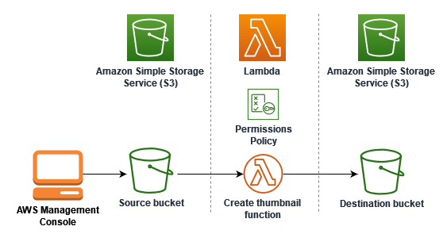

---

# Image Resizer Lambda

This AWS Lambda function is designed to automatically resize an image and store the output in a destination bucket whenever a file is uploaded to a specified source bucket.

## Architecture




## Steps

### 1. Create Source and Destination Amazon S3 Buckets

- Create two Amazon S3 buckets: one for the source and another for the destination.
- Upload a sample image to the source bucket.
- Configure permissions policies and create an execution role.

### 2. Create Lambda Function for Image Resizing

- Prepare the function deployment package by installing necessary dependencies.
  ```bash
  # Required options if on macOS
  npm install sharp@0.32.6
  ```

- Set the destination bucket environment variable.
  ```bash
  export DEST_BUCKET=destination-bucket-name
  ```

- Deploy the Lambda function using the following command:
  ```bash
  npm run package
  ```
  This command zips your source code and dependencies, creating a package that can be uploaded to AWS Lambda.

### 3. Configure Lambda Trigger

- Configure the Lambda function to be triggered when objects are uploaded to the source bucket in Amazon S3.
  Follow [AWS documentation](https://docs.aws.amazon.com/lambda/latest/dg/with-s3-tutorial.html#with-s3-tutorial-create-policy) for details.

### 4. Test Your Function

- Test your Lambda function with a dummy event to ensure it executes correctly.
- Upload an image to the source bucket to verify that the resizing process is triggered.

### Running Locally

If you wish to run the function locally, install the required dependencies and set up the destination bucket variable:

```bash
# Required options if on macOS
npm install sharp@0.32.6

export DEST_BUCKET=destination-bucket-name
```

## Deployment

To deploy your Lambda function, create a deployment package by running:

```bash
npm run package
```

Upload the generated zip file to your AWS Lambda.

---

Feel free to adjust the formatting and details according to your specific needs.
